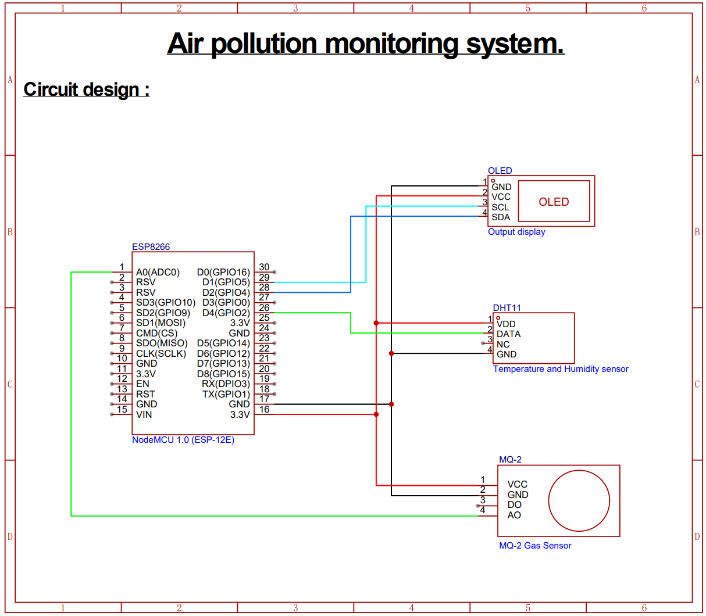

<h1>Air Pollution Monitoring System</h1>

This project monitors temperature, humidity, and gas levels using an ESP32 microcontroller with DHT11 and MQ2 sensors. Data is displayed on an OLED screen and uploaded to ThingSpeak for remote monitoring.

## Features
- Real-time temperature and humidity monitoring.
- OLED display for local data visualization.
- Integration with ThingSpeak for cloud data logging.

## Design:-

   

## Components Used
- ESP32 microcontroller
- DHT11 temperature and humidity sensor
- MQ2 gas sensor
- SSD1306 OLED display
- Adafruit SSD1306 and DHT libraries
- WiFi library for ESP32
- ThingSpeak for data logging

## Software Requirement:
- [Arduino IDE](https://www.arduino.cc/)
> Arduino IDE used to upload programming in ESP32 Board with required library.
- [Thingspeak](https://thingspeak.com/)
> ThingSpeak is a cloud-based IoT analytics platform service that lets you collect, view, and examine real-time data streams. Data can be sent from your devices to ThingSpeak, enabling instantaneous live data display.

## Setup Instructions
1. **Hardware Setup:**
   - Connect DHT11 to GPIO 14 and MQ2 analog output to GPIO 34.
   - Wire SSD1306 OLED display to ESP32.

2. **Software Setup:**
   - Install required libraries listed in the `#include` section of [main.cpp](air_pollution_monitoring_esp32.ino).
   - Configure WiFi credentials in `setup()` function.

3. **ThingSpeak Configuration:**
   - Create a ThingSpeak account and channel.
   - Replace `apiKey` and `myChannelNumber` in [main.cpp](air_pollution_monitoring_esp32.ino) with your specific values.

## Usage
- Power on the device and monitor OLED display for real-time data.
- Data is automatically uploaded to ThingSpeak every 5 seconds.

## Result:

The goal of the project at hand is to create an ESP32-based air pollution monitoring system for particular locations, such cafes, hotels, or industries. The system will use sensors to measure pollutants in real-time, such as nitrogen dioxide (NO2), carbon monoxide (CO), and particulate matter (p.m.2.5, PM10). The cloud-based IoT platform ThingSpeak will receive the data transmission for storage and analysis. The initiative does not include any control mechanisms; it only monitors and analyzes air quality. The system's objective is to enhance awareness and enable well-informed decision-making for indoor air quality management in specific public and private areas by offering extensive pollutant statistics.

   
   
   

## Guide:
- [Prof.PRAKASHA G](https://www.linkedin.com/in/prakasha-g-76a609193)

## Authors:
- [SANDEEPKUMAR S](https://www.linkedin.com/in/sandeepkumar-s-233721241/)
- [MANOHAR P HIREMATH](https://www.youtube.com/@ManoharHiremath)
- [DARSHAN D](https://www.youtube.com/@Darshan_d_Naik)
- [RAGHAVENDRA M](https://www.instagram.com/_raghu_m_.46?igsh=MXNjNGcydG1vaWhiOQ==)
